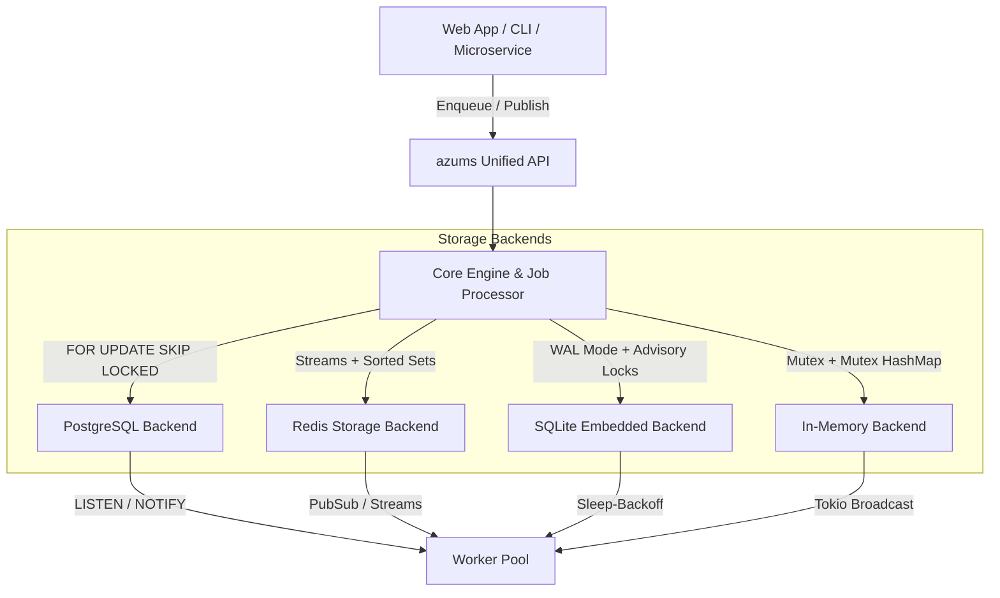

# Azums Architecture & Technical Design

`azums` is an enterprise-grade, transactional background job queue and event streaming engine designed for Rust applications. This document details its internal architecture, job state machine, concurrency guarantees, and storage algorithms.

---

## 1. High-Level System Architecture



---

## 2. Job State Machine & Lifecycle

Jobs progress through a deterministic state machine:

```
           [ Enqueue ]
                │
                ▼
           ┌──────────┐
           │  queued  │ ◄──────┐ (Retry On Failure)
           └────┬─────┘        │
                │              │
           (Leased by Worker)  │
                │              │
                ▼              │
           ┌──────────┐        │
     ┌──── │ running  ├────────┘
     │     └────┬─────┘
     │          │
(Panic / Max  (Handler Ok)
 Attempts)      │
     │          ▼
     │     ┌───────────┐
     │     │ succeeded │
     │     └───────────┘
     ▼
┌─────────┐
│   dlq   │
└─────────┘
```

### States
- **`queued`**: Job is ready for leasing by workers (`run_at <= NOW()`).
- **`running`**: Worker has acquired a lock on the job. `lock_expires_at` indicates lease duration.
- **`succeeded`**: Job executed successfully. Recorded in execution log.
- **`failed`**: Execution failed; queued for exponential backoff retry.
- **`dlq`**: Retry attempts exhausted (`attempts >= max_attempts`) or unhandled panic occurred. Moved to Dead-Letter Queue with `dlq_reason_code`.

---

## 3. Row-Level Leasing & Concurrency

### PostgreSQL (`FOR UPDATE SKIP LOCKED`)
Workers execute atomic lease queries using row-level locking to eliminate worker contention and dual-execution risks:

```sql
UPDATE jobs
SET status = 'running',
    locked_by = $1,
    locked_at = NOW(),
    lock_expires_at = NOW() + ($2 * INTERVAL '1 second'),
    attempts = attempts + 1,
    updated_at = NOW()
WHERE id IN (
    SELECT id
    FROM jobs
    WHERE queue = $3
      AND status = 'queued'
      AND run_at <= NOW()
    ORDER BY priority DESC, run_at ASC, created_at ASC, id ASC
    FOR UPDATE SKIP LOCKED
    LIMIT $4
)
RETURNING *;
```

### SQLite (WAL Mode + Transactions)
SQLite uses Write-Ahead Logging (`WAL`) mode with incremental autovacuum. Transactions acquire immediate locks on single connections to maintain zero contention.

### Redis (Atomic Lua / Sorted Sets)
Jobs are enqueued into Redis hashes and sorted sets keyed by score (`run_at` timestamp). Active processing uses `LMOVE` / `BLMOVE` to atomize leasing.

---

## 4. Phantom Job Recovery & Worker Heartbeat

If a worker crashes mid-job execution, its lease will eventually expire (`NOW() > lock_expires_at`).

The recovery background task periodically executes:

```sql
UPDATE jobs
SET status = 'queued',
    locked_by = NULL,
    locked_at = NULL,
    lock_expires_at = NULL
WHERE status = 'running'
  AND lock_expires_at < NOW();
```

---

## 5. Maintenance & Time-Partitioned Tables

PostgreSQL storage uses monthly table partitioning (`jobs_y2026m08`) to prevent `VACUUM` bloat on high-volume production databases.

Routine maintenance (`perform_maintenance()`) executes:
- PostgreSQL: `VACUUM ANALYZE jobs;`
- SQLite: `PRAGMA incremental_vacuum;`
- In-Memory / Redis: Pruning old execution histories.
