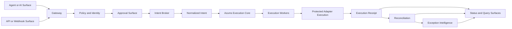

# ADR-0004: Agent and API Entry Surfaces Converge Into One Execution Path

## Status

Accepted

## Context

Azums is adding AI- and agent-driven product surfaces.

Those surfaces may include:

- agent messages
- AI-assisted request composition
- Slack actions
- approval actions
- UI-assisted request flows

Without a boundary freeze, those surfaces can drift into a second execution product with:

- duplicate state
- bypassed approvals
- direct adapter calls
- execution truth that differs from API truth
- receipts and reconciliation that no longer match core behavior

Azums already has the correct execution center:

- ingress normalizes supported work into durable intent
- execution core owns lifecycle truth
- only execution workers invoke protected adapters
- receipts, replay, reconciliation, and exception intelligence are downstream of execution truth

The new AI and agent path must join that same system, not create a parallel one.

## Decision

AI and agent flow is an entry surface, not a second execution core.

API, webhook, UI-assisted, approval-assisted, Slack-assisted, and agent-assisted requests must converge into the same normalized intent model and the same execution path.

Only Azums execution workers may trigger protected adapter execution.

Approvals, Slack actions, UI actions, and agent messages may propose, enrich, authorize, or reject work, but they must not directly mutate final execution truth.

Reconciliation remains downstream of execution truth.

## Architecture Diagram

## Boundary Rules

### Rule 1: AI does not bypass core execution

Agent- or AI-originated work must enter Azums through the same normalized-intent and execution-core path used by API and webhook traffic.

It must not:

- call protected adapters directly
- create final execution success outside core lifecycle
- create alternate receipts outside the shared receipt model
- create alternate replay or reconciliation logic

### Rule 2: API and agent paths share one normalized intent model

API, webhook, UI, Slack, approval, and agent surfaces may differ in how a request is proposed or approved, but once accepted they must converge into the same durable normalized intent model.

That means they share:

- the same tenant and auth context rules
- the same idempotency and correlation model
- the same execution receipt surface
- the same status/query surfaces
- the same reconciliation and exception surfaces

### Rule 3: only execution workers may trigger protected adapter execution

Protected adapter execution may only be invoked by Azums execution workers operating under execution-core policy.

The following surfaces must never invoke protected adapters directly:

- agent runtimes
- Slack actions
- UI actions
- approval actions
- customer-side clients

### Rule 4: approvals and actions do not mutate final execution truth directly

Approvals, Slack actions, UI actions, and agent messages may:

- create a proposal
- request approval
- attach context
- approve or reject a pending request
- request replay review through the core-approved path

They must not:

- mark execution as succeeded
- overwrite lifecycle history
- write final receipts directly
- mark reconciliation as matched
- resolve exceptions by rewriting execution truth

### Rule 5: reconciliation remains downstream

Reconciliation consumes durable execution truth after execution receipts and transitions are committed.

It must not become part of:

- intake validation
- adapter invocation policy
- execution success determination

Exception intelligence remains downstream of reconciliation and execution truth.

## Consequences

### Positive

- AI and agent product surfaces remain part of Azums, not a competing execution path
- receipts stay coherent across API and agent-originated work
- reconciliation and exception confidence remain comparable across all entry surfaces
- approval and operator actions remain auditable without creating hidden execution truth

### Negative

- AI and agent features must conform to execution-core constraints
- some conversational experiences will require proposal-and-approval steps instead of direct action
- entry-surface teams cannot add direct adapter shortcuts for speed

## Non-Goals

- implementing a full agent gateway in this ADR
- introducing a second worker class with direct adapter powers
- changing the ownership of execution receipts, replay, reconciliation, or exception truth

## Implementation Guidance

When Azums adds agent-facing runtime components, they should be modeled as:

- entry surface
- policy and identity layer
- approval layer where required
- intent broker or ingress adapter that writes normalized intent

They should not be modeled as:

- alternate execution engine
- alternate receipt writer
- alternate reconciliation source

## Decision Summary

Azums has one execution core.

Agent, API, webhook, Slack, approval, and UI surfaces may propose or authorize work, but once work is accepted it must flow through the same normalized intent, the same execution workers, the same receipt model, and the same downstream reconciliation and exception surfaces.
