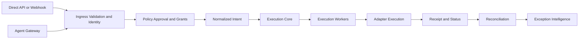

# Entry Paths

## Purpose
Azums supports two first-class entry paths into one shared execution model.

Those paths are:

- direct API / webhook integration
- agent gateway integration

The entry surface may differ, but the execution truth model does not.

## Supported Entry Paths

| Entry path | Primary users | What it does | Must not do |
|---|---|---|---|
| Direct API / webhook integration | Backend services, partner systems, event producers | Sends typed requests or signed webhooks directly into ingress for validation, normalization, and durable submit | Bypass normalized intent, core lifecycle, or receipt writing |
| Agent gateway integration | Customer-owned runtimes, AI assistants, internal automation agents | Authenticates runtime identity, resolves tenant/agent/environment, compiles free-form or structured input into a typed action request, and hands it into the same policy + execution path | Call connectors/providers directly, invent execution success, or create alternate receipts |

## One Shared Core Beneath Both Paths

Both entry paths share:

- the same tenant, environment, and identity binding rules
- the same idempotency and correlation model
- the same policy, approval, and grant controls
- the same normalized intent handoff into `execution_core`
- the same execution workers and adapter-selection logic
- the same receipt, status, replay, reconciliation, and exception surfaces

This is the product rule:

API users remain first-class.

Agent users are additive.

Azums does not become two products with two truth models.

## Architecture Diagram

## Product Positioning

Choose direct API / webhook integration when:

- your backend already produces typed requests
- you want the thinnest integration surface
- you already operate around API keys, signed webhooks, and server-side callbacks

Choose agent gateway integration when:

- your runtime starts from free-form or semi-structured instructions
- you want tenant-owned policy, approval, grant, and agent identity controls
- you want AI-assisted request compilation without letting the model become the executor

Both paths still land in the same request, receipt, replay, reconciliation, and exception model.

## Non-Negotiable Rules

1. The gateway is a request compiler, not an executor.
2. Only Azums execution workers may trigger protected adapter execution.
3. Reconciliation remains downstream of execution truth.
4. Customer UI, Slack actions, approvals, and agents do not directly mutate final execution truth.
