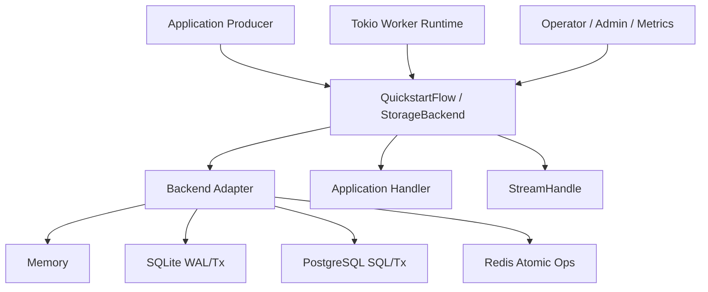

# Architecture Overview

Azums is a backend-agnostic Rust job queue and durable event streaming engine.

The product goal is:

> Write application job code once, then run it against Memory, SQLite, PostgreSQL, or Redis according
> to the durability, coordination, and deployment guarantees the application needs.

Azums is not a broker wrapper with identical marketing promises over different stores. The core API
is portable, while backend capabilities are explicit and documented.

## System Shape

The stable contract lives in `azums-core`; the batteries-included runtime lives in `azums`.

- Core models and state semantics: [model.rs](../../crates/azums-core/src/model.rs)
- Backend trait: [backend/mod.rs](../../crates/azums-core/src/backend/mod.rs)
- In-memory backend: [memory.rs](../../crates/azums-core/src/backend/memory.rs)
- PostgreSQL backend: [postgres.rs](../../crates/azums/src/backend/postgres.rs)
- SQLite backend: [sqlite.rs](../../crates/azums/src/backend/sqlite.rs)
- Redis backend: [backend.rs](../../crates/azums-redis/src/backend.rs)
- Developer-facing runtime: [quickstart.rs](../../crates/azums/src/quickstart.rs)
- Stream handle: [stream_handle.rs](../../crates/azums/src/stream_handle.rs)

## The Job Path

1. The application builds a `Job` / `NewJob` with job type, queue, payload, priority, scheduling,
   retry budget, and optional idempotency key.
2. `QuickstartFlow::enqueue` passes that job to the configured `StorageBackend`.
3. The backend persists the job and returns the durable job ID.
4. Workers lease runnable jobs for a worker identity.
5. The runtime starts a durable attempt before calling the application handler.
6. Handler success ACKs the job into a terminal completed state.
7. Handler failure is classified as retryable, permanent, timeout, panic, cancellation, or system
   failure.
8. Retryable failures reschedule the job according to retry policy.
9. Exhausted or permanent failures move the job to DLQ with reason code and durable error data.
10. Observability APIs reconstruct the lifecycle from persisted job and attempt state.

Implementation:

- Enqueue and worker runtime: [quickstart.rs](../../crates/azums/src/quickstart.rs)
- Attempt durability: [attempts.rs](../../crates/azums/src/jobs/attempts.rs)
- Retry classification: [retry.rs](../../crates/azums/src/jobs/retry.rs)
- Job explanation: [observability.rs](../../crates/azums-core/src/backend/observability.rs)

Tests:

- Developer path: [m16_developer_experience.rs](../../crates/azums/tests/m16_developer_experience.rs)
- Retry and DLQ: [failure_semantics.rs](../../crates/azums/tests/failure_semantics.rs)
- Observability: [m17_observability.rs](../../crates/azums/tests/m17_observability.rs)

## The Stream Path

1. The application asks the quickstart client for a named `StreamHandle`.
2. Producers append `NewEvent` records.
3. Each event receives a monotonic sequence number inside the stream.
4. Consumer groups read from their own offsets.
5. Acknowledgement advances only that group.
6. Replay reads from a previous sequence without mutating other groups.

Implementation:

- Core event models: [model.rs](../../crates/azums-core/src/model.rs)
- Stream trait: [stream.rs](../../crates/azums-core/src/backend/stream.rs)
- High-level stream API: [stream_handle.rs](../../crates/azums/src/stream_handle.rs)

Tests:

- Stream primitive coverage: [streams.rs](../../crates/azums/tests/streams.rs)
- Durable stream milestone: [m10_streaming.rs](../../crates/azums/tests/m10_streaming.rs)

## Backend Portability

`BackendCapabilities` is the architectural boundary between a portable API and backend-specific
guarantees. A backend must declare support for transactional enqueue, durable jobs, notifications,
streams, consumer groups, distributed workers, ordering, and backpressure behavior.

Implementation:

- Capability model: [model.rs](../../crates/azums-core/src/model.rs)
- Backend trait: [backend/mod.rs](../../crates/azums-core/src/backend/mod.rs)

Tests:

- Capability declarations: [capabilities.rs](../../crates/azums/tests/capabilities.rs)
- Backend compatibility matrix: [matrix_guard.rs](../../crates/azums/tests/matrix_guard.rs)

## What Azums Guarantees

Guaranteed across the portable API:

- Job IDs are durable identifiers for persisted jobs.
- Workers must claim a job before running it.
- Attempts are recorded durably before handler execution begins.
- Terminal states are terminal.
- Retry and DLQ behavior follows documented failure classification.
- Stream offsets are per consumer group.
- Observability APIs expose a stable shape for job explanations and queue metrics.

Backend-dependent:

- Transactional enqueue strength.
- Distributed worker coordination.
- Notification mechanism.
- Ordering precision under contention.
- Stream durability and retention behavior.
- Metrics depth and latency precision.

Not guaranteed:

- Exactly-once external side effects.
- Global total ordering across all queues.
- Recovery of data pruned by retention or maintenance.
- Identical latency, throughput, or wake-up behavior across all storage backends.

The detailed semantics live in [Execution Semantics](semantics.md) and the backend matrix lives in
[Storage Backend Equivalence](backend_equivalence.md).
