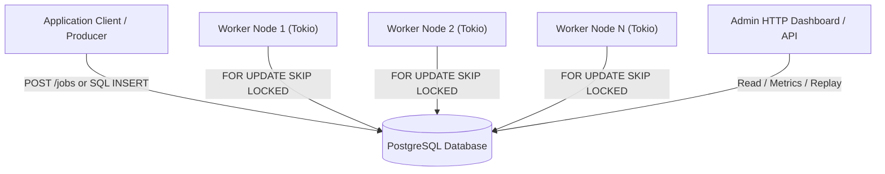

# Architecture Overview

PostgresFlow is designed as a distributed, database-centric background job queue system where PostgreSQL acts as the single source of truth for queue state, locks, attempt history, and storm-control policies.

## System Architecture

## Component Overview

1. **`JobsRepo`**: Core repository managing job enqueues, state transitions, atomic batch leasing, and replay.
2. **`AttemptsRepo`**: Immutably records every attempt, worker ID, execution latency, and error code/message.
3. **`EnqueueGuard`**: Intercepts enqueue requests to enforce maximum payload size (bytes) and queue rate limits.
4. **`JobRunner`**: Handles job execution outcomes, applying exponential backoff retry algorithms or moving failed jobs to the Dead-Letter Queue (`DLQ`).
5. **`MaintenanceRepo`**: Runs background tasks to archive succeeded jobs into `jobs_archive` and prune old history.
