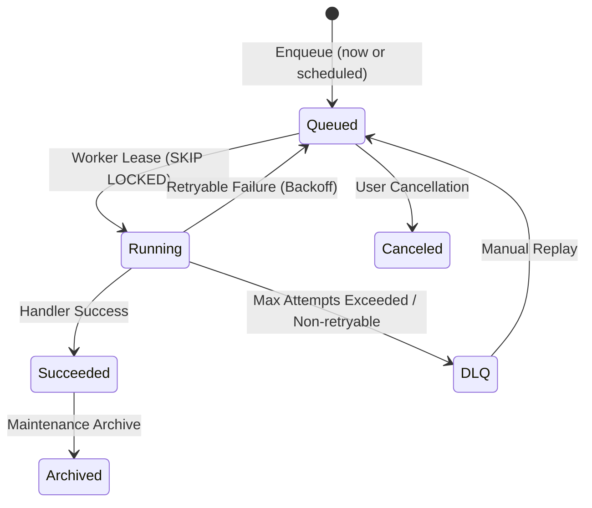
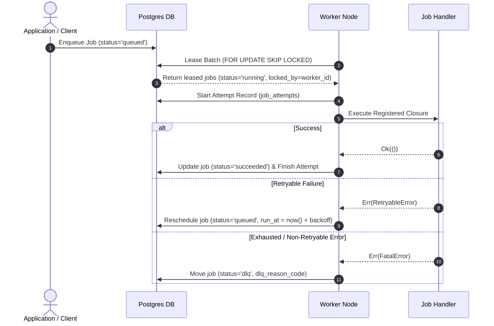

# Job Lifecycle

Jobs in PostgresFlow transition through distinct, well-defined lifecycle states: `queued`, `running`, `succeeded`, `failed`, `dlq`, and `canceled`.

## State Diagram

## Execution Sequence

