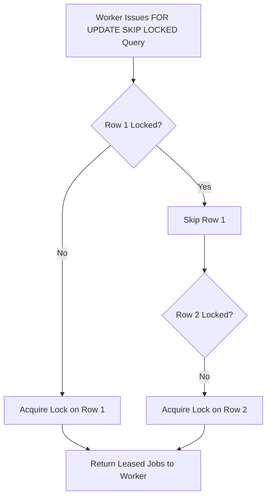

# Lease, Heartbeat & Crash Recovery

Concurrency control and multi-worker safety are primary concerns for distributed job queues. Azums treats storage state as the source of truth and models worker execution as:

```text
CLAIM
  |
  v
LEASE
  |
  v
HEARTBEAT
  |
  v
ACK
```

If a worker disappears, heartbeats stop, the lease expires, recovery reaps the abandoned lease, and the job becomes executable again.

## Guarantees

Azums guarantees:

- A runnable job is leased to at most one worker at a time.
- Starting an attempt requires the caller to hold the running lease.
- ACK, retry, DLQ, and running cancellation require the lease owner.
- Heartbeat extends only the current owner's running lease.
- Reaping an expired lease clears `locked_by`, `locked_at`, and `lock_expires_at`, then returns the job to `queued`.
- Backends with durable attempt records mark abandoned running attempts as `failed` with `error_code = 'LEASE_EXPIRED'`.
- A committed non-terminal job must not silently disappear because a worker dies.

Azums does not guarantee that a crashed handler performed no external side effects. Handlers must still be idempotent.

## How SKIP LOCKED Works

When a worker node calls `lease_jobs_batch`, it issues a specialized SQL query:

```sql
WITH runnable AS (
  SELECT id, dataset_id
  FROM jobs
  WHERE queue = $1
    AND status = 'queued'
    AND run_at <= now()
  ORDER BY priority DESC, run_at ASC, created_at ASC
  LIMIT $2
  FOR UPDATE SKIP LOCKED
)
UPDATE jobs j
SET status = 'running',
    locked_at = now(),
    locked_by = $3,
    lock_expires_at = now() + ($4 || ' seconds')::interval
FROM runnable r
WHERE j.id = r.id AND j.dataset_id = r.dataset_id
RETURNING j.*;
```



## Advantages of SKIP LOCKED

1. **Zero Lock Contention**: Workers never block each other waiting for table locks. If Worker A is processing Job 1, Worker B instantly skips Job 1 and leases Job 2.
2. **Crash Resilience**: If a worker process crashes abruptly while holding TCP connection locks, PostgreSQL automatically releases row locks when the connection dies.
3. **Lock Expiry Reaping**: In addition to session locks, `lock_expires_at` timestamps allow active workers to reap and re-queue jobs abandoned by hard-crashed workers (`reap_expired_locks`).

## Recovery Matrix

| Failure point | Expected result | Automated coverage |
|---|---|---|
| Before claim | Committed queued job remains queued. | SQLite child-process crash test |
| After claim | Job remains running until lease expiry, then reaps to queued. | SQLite process-kill test |
| During execution | Running attempt closes as `LEASE_EXPIRED`; job reaps to queued. | SQLite process-kill test; PostgreSQL conditional integration test |
| Immediately before ACK | Handler result is not durable; attempt closes as `LEASE_EXPIRED`; job reaps to queued. | SQLite process-kill test |
| Immediately after handler success, before ACK | Same as before ACK; handler success alone is not the commit point. | SQLite process-kill test |
| During heartbeat | Last heartbeat controls expiry; after the process dies and the extended lease expires, job reaps to queued. | SQLite process-kill test |
| During database disconnect | Uncommitted claim rolls back, or committed running lease is recoverable after expiry. | SQLite disconnect test; PostgreSQL conditional connection-loss test |
| Database restart | Durable SQL backends recover from committed storage state; uncommitted transactions are rolled back by the database. | Backend/environment test, not run by default unit suite |

## ACK Boundary

The ACK boundary is the successful storage transition to `completed`/`succeeded`, not the handler returning `Ok(())` in process memory.

If the worker dies after the handler returns but before ACK, Azums treats the work as abandoned. The job becomes recoverable after lease expiry, and the handler may run again. This is why Azums provides at-least-once execution rather than exactly-once external side effects.
