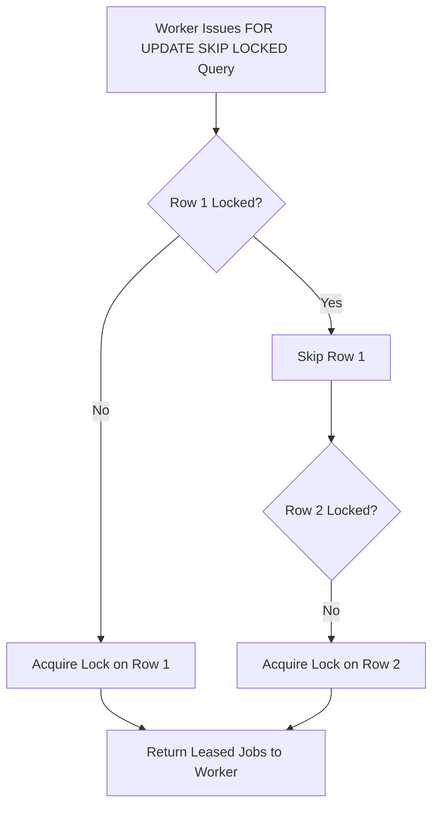

# Transactional Leasing & SKIP LOCKED

Concurrency control and multi-worker safety are primary concerns for distributed job queues. PostgresFlow relies on PostgreSQL's row-level locking capabilities (`FOR UPDATE SKIP LOCKED`) rather than Redis advisory locks or external coordination primitives.

## How SKIP LOCKED Works

When a worker node calls `lease_jobs_batch`, it issues a specialized SQL query:

```sql
WITH runnable AS (
  SELECT id, dataset_id
  FROM jobs
  WHERE queue = $1
    AND status = 'queued'
    AND run_at <= now()
  ORDER BY priority DESC, run_at ASC, created_at ASC
  LIMIT $2
  FOR UPDATE SKIP LOCKED
)
UPDATE jobs j
SET status = 'running',
    locked_at = now(),
    locked_by = $3,
    lock_expires_at = now() + ($4 || ' seconds')::interval
FROM runnable r
WHERE j.id = r.id AND j.dataset_id = r.dataset_id
RETURNING j.*;
```



## Advantages of SKIP LOCKED

1. **Zero Lock Contention**: Workers never block each other waiting for table locks. If Worker A is processing Job 1, Worker B instantly skips Job 1 and leases Job 2.
2. **Crash Resilience**: If a worker process crashes abruptly while holding TCP connection locks, PostgreSQL automatically releases row locks when the connection dies.
3. **Lock Expiry Reaping**: In addition to session locks, `lock_expires_at` timestamps allow active workers to reap and re-queue jobs abandoned by hard-crashed workers (`reap_expired_locks`).
