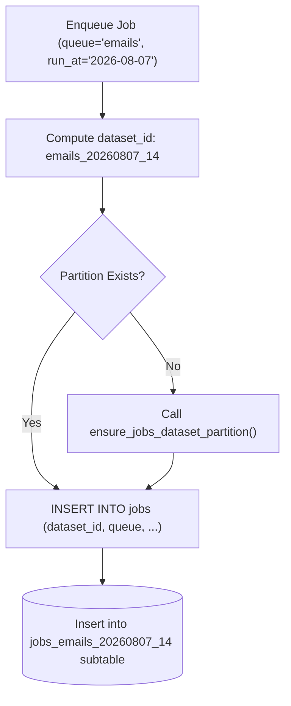

# Dataset Partitioning Strategy

High-volume queues quickly produce millions of job records, causing index degradation and bloated `VACUUM` execution times. PostgresFlow prevents table bloat using time-partitioned datasets and automatic archiving.

## Time Partitioning Strategy

Jobs are automatically routed into hourly/monthly dataset partitions named according to the queue and scheduled timestamp (`run_at`):

```text
jobs (Declarative Partitioned Table by RANGE)
 ├── jobs_default_20260201_00
 ├── jobs_default_20260201_01
 ├── jobs_emails_20260201_00
 └── jobs_default_overflow (DEFAULT Partition)
```



## Automatic Archiving & Maintenance

To keep the primary `jobs` table small and fast:
1. **Succeeded Jobs Archive**: Background maintenance tasks move `status='succeeded'` jobs older than N days into `jobs_archive`.
2. **Attempt History Pruning**: Old attempt audit logs (`job_attempts`) and policy decision records (`policy_decisions`) are automatically pruned.
3. **Partition Detach**: Aged partitions can be detached or dropped rapidly without full table locks.
