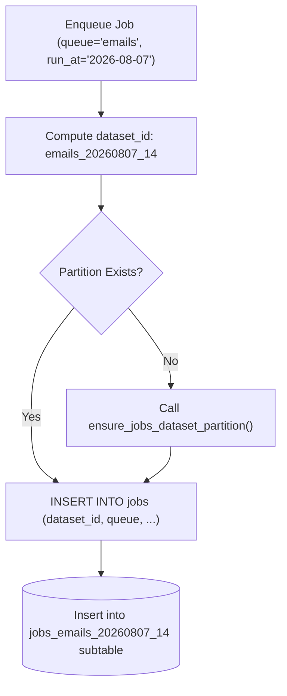

# Dataset Partitioning Strategy

High-volume background queues quickly produce millions of job records, causing index degradation and bloated `VACUUM` execution times. `azums` prevents table bloat using time-partitioned datasets, status-partitioned tables, and automatic archiving.

---

## 1. Time Partitioning Strategy (`PARTITION BY RANGE (run_at)`)

Routing jobs by `run_at` or dataset time-buckets keeps hot active partitions small and allows rapid dropping or archiving of historical data without full-table locks.

```sql
-- 1. Create parent table partitioned by time range
CREATE TABLE jobs_by_time (
    id UUID NOT NULL DEFAULT gen_random_uuid(),
    queue TEXT NOT NULL,
    job_type TEXT NOT NULL,
    payload_json JSONB NOT NULL DEFAULT '{}'::jsonb,
    run_at TIMESTAMPTZ NOT NULL DEFAULT now(),
    status TEXT NOT NULL DEFAULT 'queued',
    priority INT NOT NULL DEFAULT 0,
    created_at TIMESTAMPTZ NOT NULL DEFAULT now(),
    PRIMARY KEY (run_at, id)
) PARTITION BY RANGE (run_at);

-- 2. Create daily or monthly partitions
CREATE TABLE jobs_y2026m08 PARTITION OF jobs_by_time
    FOR VALUES FROM ('2026-08-01 00:00:00+00') TO ('2026-09-01 00:00:00+00');

CREATE TABLE jobs_y2026m09 PARTITION OF jobs_by_time
    FOR VALUES FROM ('2026-09-01 00:00:00+00') TO ('2026-10-01 00:00:00+00');
```



---

## 2. Status Partitioning Strategy (`PARTITION BY LIST (status)`)

In applications with high completed job volumes, partitioning by `status` isolates active `queued` and `running` jobs into a tiny subtable, completely insulating worker leasing queries from historical `succeeded` or `dlq` records.

```sql
-- 1. Create parent table partitioned by job lifecycle status
CREATE TABLE jobs_by_status (
    id UUID NOT NULL DEFAULT gen_random_uuid(),
    queue TEXT NOT NULL,
    job_type TEXT NOT NULL,
    payload_json JSONB NOT NULL DEFAULT '{}'::jsonb,
    run_at TIMESTAMPTZ NOT NULL DEFAULT now(),
    status TEXT NOT NULL DEFAULT 'queued',
    priority INT NOT NULL DEFAULT 0,
    created_at TIMESTAMPTZ NOT NULL DEFAULT now(),
    PRIMARY KEY (status, id)
) PARTITION BY LIST (status);

-- 2. Create dedicated status partitions
CREATE TABLE jobs_active PARTITION OF jobs_by_status
    FOR VALUES IN ('queued', 'running');

CREATE TABLE jobs_completed PARTITION OF jobs_by_status
    FOR VALUES IN ('succeeded');

CREATE TABLE jobs_failed PARTITION OF jobs_by_status
    FOR VALUES IN ('failed', 'dlq', 'canceled');
```

---

## Automatic Archiving & Maintenance

To keep the primary `jobs` table small and fast:
1. **Automated `VACUUM ANALYZE`**: Background maintenance workers automatically run `VACUUM ANALYZE` every 5 minutes on `jobs`, `job_attempts`, `stream_events`, `policy_decisions`, and `jobs_archive`.
2. **Succeeded Jobs Archive**: Background maintenance tasks move `status='succeeded'` jobs older than N days into `jobs_archive`.
3. **Attempt History Pruning**: Old attempt audit logs (`job_attempts`) and policy decision records (`policy_decisions`) are automatically pruned.

