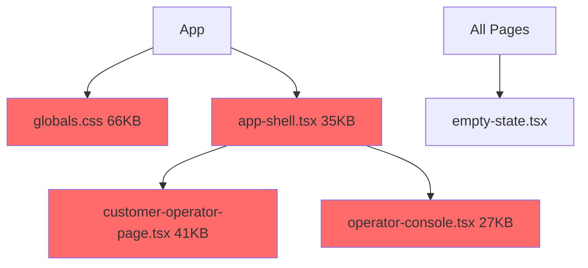
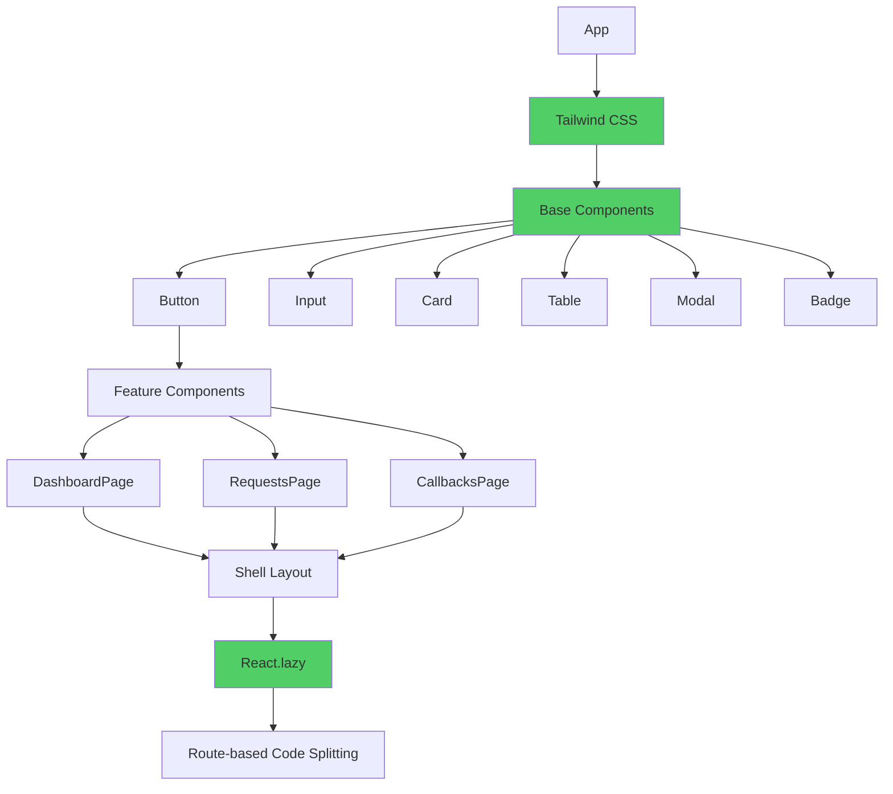

# UI Modernization Plan

## Executive Summary

The current operator UI (`apps/operator_ui_next`) has significant architectural issues that make it difficult to maintain, test, and extend. This plan outlines a comprehensive modernization effort to:

1. **Reduce bundle size by 60-80%** through Tailwind CSS and code splitting
2. **Improve maintainability** by breaking 100KB+ of monolithic code into small, focused components
3. **Accelerate development** with a reusable UI component library

---

## Current State Analysis

### File Size Summary

| File                         | Lines     | Est. Size   | Issue                        |
| ---------------------------- | --------- | ----------- | ---------------------------- |
| `globals.css`                | 3,970     | 66KB+       | Monolithic - no tree-shaking |
| `customer-operator-page.tsx` | 1,141     | 41KB+       | All views in one file        |
| `app-shell.tsx`              | 971       | 35KB+       | Shell + nav + state mixed    |
| `operator-console.tsx`       | 500       | 27KB+       | Inline rendering logic       |
| **Total**                    | **6,582** | **~170KB+** | **No code splitting**        |

### Dependencies

```json
{
  "next": "15.5.12",
  "react": "18.3.1",
  "react-dom": "18.3.1"
}
```

### Missing Modern Tools

- ❌ Tailwind CSS
- ❌ UI Component Library
- ❌ Code Splitting
- ❌ Lazy Loading
- ❌ Type-safe component props

---

## Architecture Diagram

### Current Architecture (Monolithic)



### Target Architecture (Component-Based)



---

## Phase 1: Foundation (Tailwind CSS + UI Components)

### Step 1.1: Install Tailwind CSS

**File:** `apps/operator_ui_next/package.json`

Add dependencies:

```json
{
  "devDependencies": {
    "tailwindcss": "^3.4.0",
    "postcss": "^8.4.0",
    "autoprefixer": "^10.4.0",
    "@tailwindcss/forms": "^0.5.0",
    "@tailwindcss/typography": "^0.5.0"
  }
}
```

**Files to create:**

- `apps/operator_ui_next/tailwind.config.js` - Tailwind configuration with custom theme
- `apps/operator_ui_next/postcss.config.js` - PostCSS configuration
- `apps/operator_ui_next/app/globals.css` - Replace with Tailwind directives

### Step 1.2: Create Base UI Components

**Directory:** `apps/operator_ui_next/components/ui/`

Create the following components with Tailwind styling:

| Component         | Purpose                                    | Priority |
| ----------------- | ------------------------------------------ | -------- |
| `button.tsx`      | Primary, secondary, ghost, danger variants | P0       |
| `input.tsx`       | Text, email, password, search inputs       | P0       |
| `select.tsx`      | Dropdown select                            | P0       |
| `textarea.tsx`    | Multi-line text input                      | P0       |
| `card.tsx`        | Container with header/body/footer          | P0       |
| `badge.tsx`       | Status indicators                          | P0       |
| `spinner.tsx`     | Loading indicator                          | P0       |
| `table.tsx`       | Data table with sorting                    | P0       |
| `tabs.tsx`        | Tab navigation                             | P1       |
| `modal.tsx`       | Dialog overlay                             | P1       |
| `pagination.tsx`  | Page navigation                            | P1       |
| `empty-state.tsx` | Already exists - enhance                   | P1       |
| `tooltip.tsx`     | Hover tooltips                             | P2       |
| `accordion.tsx`   | Collapsible sections                       | P2       |

### Step 1.3: Component Design System

Define in `tailwind.config.js`:

```javascript
module.exports = {
  content: ["./app/**/*.{js,ts,jsx,tsx}", "./components/**/*.{js,ts,jsx,tsx}"],
  theme: {
    extend: {
      colors: {
        bg: { 1: "#07141e", 2: "#102738", 3: "#184159" },
        panel: {
          DEFAULT: "rgba(7, 18, 28, 0.83)",
          strong: "rgba(8, 22, 34, 0.95)",
        },
        line: {
          DEFAULT: "rgba(137, 197, 224, 0.2)",
          strong: "rgba(137, 226, 234, 0.46)",
        },
        accent: { DEFAULT: "#25d6ac", strong: "#64e8f6" },
        muted: "#a6c3d4",
        danger: "#ff7a72",
        success: "#49e3bc",
        warning: "#f9cf7a",
      },
      fontFamily: {
        sans: ["Inter", "Segoe UI", "sans-serif"],
        mono: ["JetBrains Mono", "monospace"],
      },
      borderRadius: {
        panel: "16px",
        card: "12px",
      },
    },
  },
  plugins: [require("@tailwindcss/forms"), require("@tailwindcss/typography")],
};
```

---

## Phase 2: Shell Refactoring

### Step 2.1: Extract Shell Components

**File:** `components/app-shell.tsx` (971 lines) → Split into:

| New File                                  | Content             | Est. Lines |
| ----------------------------------------- | ------------------- | ---------- |
| `components/shell/sidebar.tsx`            | Navigation links    | 150        |
| `components/shell/workspace-switcher.tsx` | Workspace dropdown  | 100        |
| `components/shell/quick-search.tsx`       | Global search       | 100        |
| `components/shell/user-menu.tsx`          | User avatar/menu    | 80         |
| `components/shell/shell-layout.tsx`       | Main layout wrapper | 100        |

### Step 2.2: Shell Layout Component

```typescript
// components/shell/shell-layout.tsx
interface ShellLayoutProps {
  children: React.ReactNode;
  activePath: string;
  workspaceName?: string;
  user?: SessionRecord;
}

export function ShellLayout({ children, activePath, workspaceName, user }: ShellLayoutProps) {
  return (
    <div className="min-h-screen grid grid-cols-[276px_1fr]">
      <Sidebar activePath={activePath} workspaceName={workspaceName} user={user} />
      <main>{children}</main>
    </div>
  );
}
```

---

## Phase 3: Operator Console Refactoring

### Step 3.1: Extract Console Components

**File:** `components/operator-console.tsx` (500 lines) → Split into:

| New File                               | Content                 | Priority |
| -------------------------------------- | ----------------------- | -------- |
| `components/ops/jobs-panel.tsx`        | Jobs table with filters | P0       |
| `components/ops/request-inspector.tsx` | Request detail view     | P0       |
| `components/ops/flow-visualizer.tsx`   | Flow coverage display   | P1       |
| `components/ops/callback-config.tsx`   | Callback settings       | P1       |
| `components/ops/activity-log.tsx`      | Activity stream         | P2       |

### Step 3.2: Implement Tab System

```typescript
// components/ui/tabs.tsx
interface Tab {
  id: string;
  label: string;
  icon?: React.ReactNode;
}

interface TabsProps {
  tabs: Tab[];
  activeTab: string;
  onChange: (tabId: string) => void;
}
```

---

## Phase 4: Customer Operator Page Refactoring

### Step 4.1: Extract View Components

**File:** `components/customer-operator-page.tsx` (1,141 lines) → Split into:

| New File                                 | Content                | Priority |
| ---------------------------------------- | ---------------------- | -------- |
| `components/ops/overview-panel.tsx`      | Overview dashboard     | P0       |
| `components/ops/jobs-view.tsx`           | Jobs list with filters | P0       |
| `components/ops/replay-panel.tsx`        | Replay controls        | P0       |
| `components/ops/dead-letters-view.tsx`   | Dead letter queue      | P1       |
| `components/ops/deliveries-view.tsx`     | Delivery history       | P1       |
| `components/ops/intake-audits-view.tsx`  | Audit log viewer       | P1       |
| `components/ops/adapter-health-view.tsx` | Health status          | P1       |
| `components/ops/security-view.tsx`       | Security settings      | P2       |
| `components/ops/workspaces-view.tsx`     | Workspace management   | P2       |
| `components/ops/activity-view.tsx`       | Activity stream        | P2       |

### Step 4.2: Route-Based Code Splitting

```typescript
// Use React.lazy for each view
const OverviewPanel = lazy(() => import('./ops/overview-panel'));
const JobsView = lazy(() => import('./ops/jobs-view'));
const ReplayPanel = lazy(() => import('./ops/replay-panel'));

// In the main component:
<Suspense fallback={<Spinner />}>
  {view === 'overview' && <OverviewPanel />}
  {view === 'jobs' && <JobsView />}
  {view === 'replay' && <ReplayPanel />}
</Suspense>
```

---

## Phase 5: Customer Pages Refactoring

### Step 5.1: Extract Shared Components

**Pattern found:** Multiple pages have identical `Summary` component:

```typescript
// Found in: dashboard-page.tsx, requests-page.tsx
function Summary({ label, value }: { label: string; value: string }) {
  return (
    <div className="summary-card">
      <span>{label}</span>
      <strong>{value}</strong>
    </div>
  );
}
```

**Solution:** Move to `components/ui/summary-card.tsx`

### Step 5.2: Create Data Table Component

Many pages have similar table patterns. Create reusable `data-table.tsx`:

```typescript
interface Column<T> {
  key: keyof T;
  header: string;
  render?: (value: T[keyof T], item: T) => React.ReactNode;
  sortable?: boolean;
}

interface DataTableProps<T> {
  data: T[];
  columns: Column<T>[];
  sortable?: boolean;
  pagination?: { page: number; limit: number; total: number };
}
```

---

## Implementation Roadmap

### Phase 1: Foundation (Week 1)

- [ ] Install and configure Tailwind CSS
- [ ] Create tailwind.config.js with custom theme
- [ ] Replace globals.css with Tailwind directives
- [ ] Create 8 core UI components (Button, Input, Card, Badge, etc.)

### Phase 2: Shell (Week 1-2)

- [ ] Refactor app-shell.tsx into 5 smaller components
- [ ] Update all pages to use new ShellLayout
- [ ] Test navigation and workspace switching

### Phase 3: Operator Console (Week 2)

- [ ] Refactor operator-console.tsx into 5 components
- [ ] Implement Tabs component
- [ ] Add flow visualizer

### Phase 4: Customer Operator (Week 2-3)

- [ ] Refactor customer-operator-page.tsx into 10 view components
- [ ] Implement React.lazy for route splitting
- [ ] Add Suspense boundaries with loading states

### Phase 5: Customer Pages (Week 3)

- [ ] Create shared DataTable component
- [ ] Refactor dashboard-page.tsx
- [ ] Refactor requests-page.tsx
- [ ] Refactor remaining customer pages

### Phase 6: Optimization (Week 3-4)

- [ ] Enable Next.js bundle analyzer
- [ ] Verify code splitting is working
- [ ] Test lazy loading
- [ ] Optimize Tailwind purge config

---

## Expected Outcomes

| Metric            | Before      | After      | Improvement             |
| ----------------- | ----------- | ---------- | ----------------------- |
| CSS Bundle        | 66KB+       | ~10KB      | 85% smaller             |
| Initial JS Bundle | ~170KB      | ~60KB      | 65% smaller             |
| Largest Component | 1,141 lines | ~150 lines | 87% smaller             |
| UI Components     | 1           | 15+        | 15x more reusable       |
| Maintainability   | Low         | High       | Significant improvement |

---

## Files to Modify

### New Files to Create

1. `apps/operator_ui_next/tailwind.config.js`
2. `apps/operator_ui_next/postcss.config.js`
3. `apps/operator_ui_next/components/ui/button.tsx`
4. `apps/operator_ui_next/components/ui/input.tsx`
5. `apps/operator_ui_next/components/ui/select.tsx`
6. `apps/operator_ui_next/components/ui/textarea.tsx`
7. `apps/operator_ui_next/components/ui/card.tsx`
8. `apps/operator_ui_next/components/ui/badge.tsx`
9. `apps/operator_ui_next/components/ui/spinner.tsx`
10. `apps/operator_ui_next/components/ui/table.tsx`
11. `apps/operator_ui_next/components/ui/tabs.tsx`
12. `apps/operator_ui_next/components/ui/modal.tsx`
13. `apps/operator_ui_next/components/ui/pagination.tsx`
14. `apps/operator_ui_next/components/shell/shell-layout.tsx`
15. `apps/operator_ui_next/components/shell/sidebar.tsx`
16. `apps/operator_ui_next/components/shell/workspace-switcher.tsx`
17. `apps/operator_ui_next/components/shell/quick-search.tsx`
18. `apps/operator_ui_next/components/shell/user-menu.tsx`
19. `apps/operator_ui_next/components/ops/overview-panel.tsx`
20. `apps/operator_ui_next/components/ops/jobs-view.tsx`
21. `apps/operator_ui_next/components/ops/jobs-panel.tsx`
22. `apps/operator_ui_next/components/ops/request-inspector.tsx`
23. `apps/operator_ui_next/components/ops/replay-panel.tsx`
24. `apps/operator_ui_next/components/ops/dead-letters-view.tsx`
25. `apps/operator_ui_next/components/ops/deliveries-view.tsx`
26. `apps/operator_ui_next/components/ops/intake-audits-view.tsx`
27. `apps/operator_ui_next/components/ops/adapter-health-view.tsx`
28. `apps/operator_ui_next/components/ops/security-view.tsx`
29. `apps/operator_ui_next/components/ops/workspaces-view.tsx`
30. `apps/operator_ui_next/components/ops/activity-view.tsx`
31. `apps/operator_ui_next/components/ui/summary-card.tsx`
32. `apps/operator_ui_next/components/ui/data-table.tsx`
33. `apps/operator_ui_next/components/ui/tooltip.tsx`
34. `apps/operator_ui_next/components/ui/accordion.tsx`

### Files to Modify

1. `apps/operator_ui_next/package.json` - Add Tailwind dependencies
2. `apps/operator_ui_next/app/globals.css` - Replace with Tailwind directives + custom styles
3. `apps/operator_ui_next/app/layout.tsx` - Add any layout changes
4. `apps/operator_ui_next/components/app-shell.tsx` - Refactor to use new components
5. `apps/operator_ui_next/components/operator-console.tsx` - Refactor to use new components
6. `apps/operator_ui_next/components/customer-operator-page.tsx` - Refactor to use new components
7. `apps/operator_ui_next/components/customer/dashboard-page.tsx` - Use new UI components
8. `apps/operator_ui_next/components/customer/requests-page.tsx` - Use new UI components

### Files to Delete After Refactoring

1. `apps/operator_ui_next/app/globals.css` (replaced by Tailwind)

---

## Risk Mitigation

### Risks

1. **Breaking existing styles** - Mitigate by keeping custom CSS in globals.css until fully migrated
2. **Component API changes** - Mitigate by documenting all component APIs
3. **Testing burden** - Mitigate by testing each component in isolation first
4. **Time estimate uncertainty** - Mitigate by implementing in phases with user check-ins

### Rollback Plan

If issues arise:

1. Keep old files alongside new until fully tested
2. Use feature flags for new components
3. Can always revert to old globals.css (it's in git)

---

## Success Criteria

- [ ] Tailwind CSS installed and configured
- [ ] 15+ reusable UI components created
- [ ] All 3 monster components refactored (< 200 lines each)
- [ ] Code splitting implemented (lazy loading)
- [ ] CSS bundle reduced by 80%+
- [ ] Initial JS bundle reduced by 60%+
- [ ] All existing functionality preserved
- [ ] No visual regressions

---

_Plan created for azums operator_ui_next modernization_
